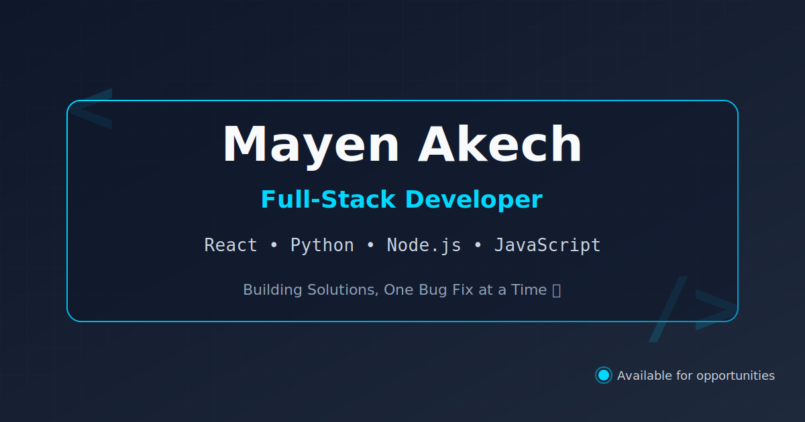

# Hi there, I'm Mayen 👋

---

---

## 🚀 About Me

I'm a **Full-Stack Web Developer** passionate about building innovative solutions and solving complex problems. I specialize in creating responsive, user-friendly web applications with a focus on clean code and modern development practices.

- 🔭 **What I Do:** Build full-stack web applications that solve real-world problems
- 🌱 **Current Focus:** Advanced JavaScript patterns, React ecosystem, and scalable backend architecture
- 💡 **Passion:** Full-stack web development, UI/UX design, and exploring emerging web technologies
- 📫 **Get in Touch:** [mayenakech9@gmail.com](mailto:mayenakech9@gmail.com)
- ⚡ **Fun Fact:** I thrive on tackling new challenges—whether building smart parking solutions or innovative web concepts—and love creating solutions that push boundaries.

---

## 🛠️ Technical Skills

<b>Frontend Development</b>

- **Languages:** JavaScript (ES6+), HTML5, CSS3
- **Frameworks & Libraries:** React (Hooks, State Management)
- **Styling:** Tailwind CSS, Bootstrap, CSS Grid & Flexbox
- **Tools:** Webpack, Vite, npm, yarn

<b>Backend Development</b>

- **Languages:** Python
- **Frameworks:** Flask, REST APIs
- **Databases:** SQL, Database Design
- **Authentication:** Secure user authentication & authorization

<b>Development Tools & Platforms</b>

- **Version Control:** Git, GitHub
- **Deployment:** Render, Vercel, Netlify
- **IDEs & Editors:** VS Code
- **Other:** RESTful API design, responsive web design

---

## 🌟 Featured Projects

| Project                                                                     | Description                                                                                                                                                                   | Tech Stack                                          |
| --------------------------------------------------------------------------- | ----------------------------------------------------------------------------------------------------------------------------------------------------------------------------- | --------------------------------------------------- |
| **[Reviwa](https://reviwa.netlify.app/)** - Smart Waste Management          | Community-driven waste management platform with waste reporting, real-time mapping, eco-points gamification, admin dashboard, and email notifications for sustainable cities. | React, Node.js, MongoDB, Tailwind CSS, Leaflet Maps |
| **[Palmstar](https://palmstar.onrender.com)** - Travel Booking Platform     | Comprehensive travel booking system with real-time availability for flights, hotels, and rentals. Features seamless UX and modern web technologies.                           | JavaScript, Tailwind CSS, Flask                     |
| **[TechBlog](https://techblog-zqhv.onrender.com/)** - Modern Tech Platform  | Full-stack blog platform with responsive design, article curation, and clean navigation for tech enthusiasts.                                                                 | Flask, React, Tailwind CSS                          |
| **[EasyPark](https://easypark-lgqj.onrender.com)** - Smart Parking Solution | Intelligent parking reservation system with live availability updates and secure user authentication.                                                                         | Python, Flask, JavaScript                           |
| **[QRgen](https://bluewey.netlify.app)** - QR Code Generator                | Professional QR code generator for URLs, WiFi credentials, contact cards, and plain text with an intuitive interface.                                                         | React, JavaScript, Tailwind CSS                     |
| **[Age Calculator](https://mayen007.github.io/age-calculator/)**            | Interactive age calculator with precise date calculations built with vanilla JavaScript.                                                                                      | JavaScript, HTML5, CSS3                             |
| **[Rock Paper Scissors](https://github.com/Mayen007/Rock-Paper-Scissors)**  | Interactive game with score tracking and smooth animations.                                                                                                                   | Vanilla JavaScript, CSS Animations                  |

---

## 📈 GitHub Insights

---

## 📌 Featured Stats

- **Portfolio Website:** [makech.netlify.app](https://makech.netlify.app)
- **Total Repositories:** Check out my [GitHub Profile](https://github.com/Mayen007)
- **Languages:** JavaScript, Python, HTML5, CSS3
- **Specialization:** Full-Stack Web Development

---

## 🤝 Connect With Me

---

**Thanks for visiting my profile! Feel free to reach out or explore my repositories.** 🚀

